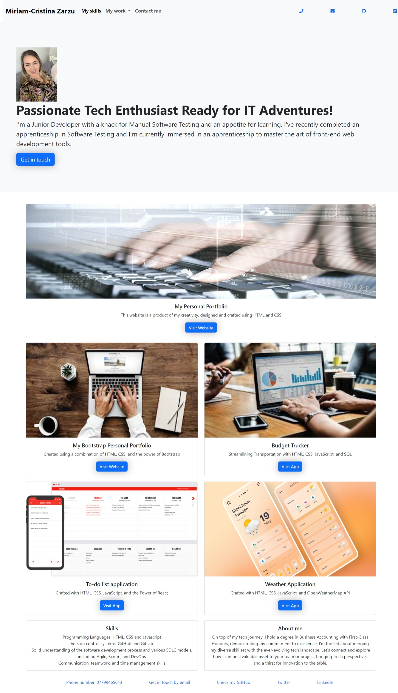

# Personal Portfolio with Bootstrap

Welcome to my personal portfolio project! This website showcases my work and skills while demonstrating the power of Bootstrap in creating a responsive and visually appealing design.

## Project Overview

- **Technology Stack:** HTML, CSS, Bootstrap
- **Deployment:** [Insert Deployment Link]

## Screenshot

## Key Features

- Responsive Design: Utilized Bootstrap to ensure the website is responsive across different screen sizes and devices.
- Minimal Media Queries: Minimized the use of media queries by leveraging Bootstrap's responsive classes.
- Portfolio Showcase: Displayed my work and projects to highlight my skills and experiences.
- User-Friendly: The website is designed for easy navigation and a pleasant user experience.

## Deployment

The website is deployed and accessible at [Insert Deployment Link]. You can visit it to explore my portfolio and learn more about me.

## Usage

Feel free to use this project as a reference for building your own personal portfolio with Bootstrap. You can also adapt and customize it to suit your needs and showcase your unique skills and projects.

## Local Development

To work on this project locally:

1. Clone the repository: `git clone [https://github.com/MiriamCristinaZ/Bootstrap-Portfolio]`
2. Open the project in your preferred code editor.
3. Modify the HTML, CSS, and content as needed.
4. Use a live server extension or run it on your local server for testing and development.

## Contact

If you have any questions or feedback, feel free to reach out to me: [miriam.cristina23@yahoo.com]

Happy coding!
